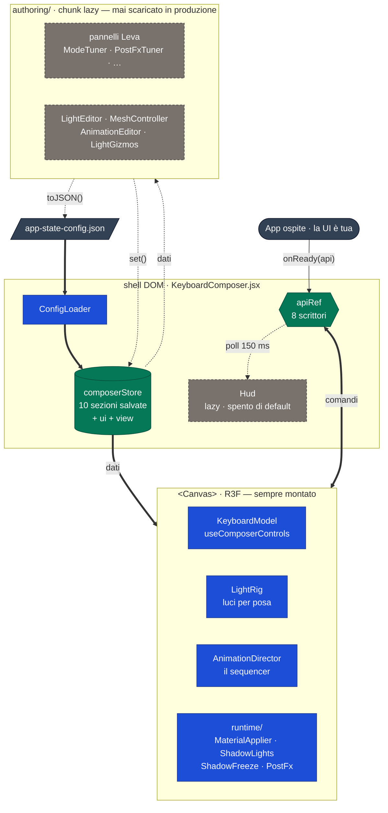
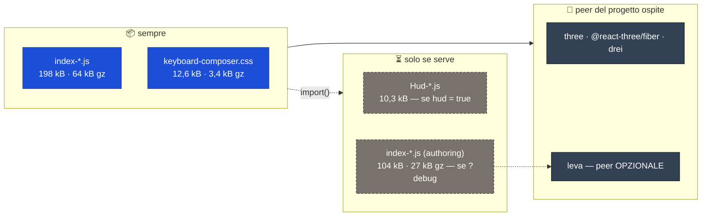
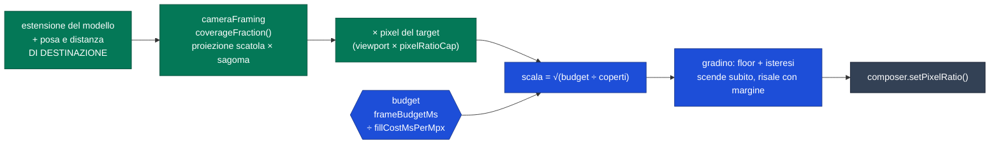
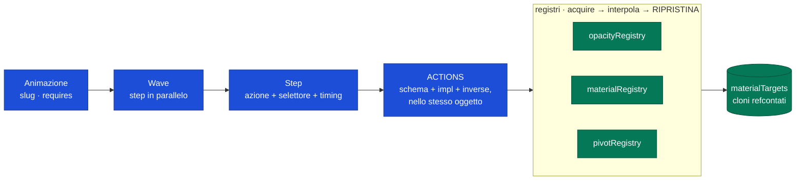

<div align="center">

# ⌨️ Keyboard Composer

**Configuratore 3D di prodotto in un solo componente React.**
Navigazione su grafo di pose, rig di luci autorato per posa, sequencer di animazioni.

<sub>
  React 19 · three 0.178 · @react-three/fiber 9 · @react-three/drei 10 · Vite 6
</sub>

<br/>

`v0.1.0` — pacchetto npm `keyboard-composer` · `WIP`

</div>

---

Non è un viewer 3D con orbita libera: è una **vetrina di prodotto guidata**. Il
modello si muove fra pose nominate, ogni posa ha la sua illuminazione autorata,
e ogni movimento — inquadrature, opacità, swap di varianti — è una sequenza
salvata su file, non codice.

Il componente **non porta UI**: un'app ospite disegna i propri pulsanti e li
collega a una piccola API imperativa (`onReady(api)`).

> **Due mondi nello stesso sorgente.** Il *prodotto* (ciò che viene spedito) e
> il *playground di authoring* (`?debug`, con i pannelli Leva) vivono nella
> stessa cartella, separati da un confine `import()`: in produzione `leva` e
> l'editor non vengono nemmeno scaricati.

<table>
<tr><td>

**[⚡ Avvio rapido](#-avvio-rapido)** · **[✨ Cosa fa](#-cosa-fa)** · **[🔌 Integrazione](#-integrazione)** · **[🧩 Prodotti](#-un-configuratore-molti-modelli)**

**[🏗 Architettura](#-architettura)** · **[🎛 Authoring `?debug`](#-authoring-debug)** · **[📦 Pipeline asset](#-pipeline-asset-obj--glb)** · **[⚠️ Limiti noti](#️-stato-e-limiti-noti)**

</td></tr>
</table>

---

## ⚡ Avvio rapido

```bash
npm install
npm run dev          # playground su http://localhost:5174  (porta da $PORT)
npm run build        # build SPA         → dist/
npm run build:lib    # pacchetto npm     → dist-lib/
```

Aggiungi `?debug` all'URL per aprire l'ambiente di authoring.

> ⚠️ **`dist/` e `dist-lib/` sono SORELLE, non annidate.** Il pacchetto
> costruiva in `dist/lib/` e `npm run build` lo cancellava in silenzio: la SPA
> ha `outDir: 'dist'` e Vite ci applica `emptyOutDir: true` di default. Nessun
> errore, nessun avviso — ci si accorgeva al `publish`.

> **Un solo controllo automatico, e gira da solo.** `build:lib` termina con
> `postbuild:lib` → `scripts/ssr-smoke.mjs`, che **importa e renderizza su
> Node** il pacchetto appena costruito. Per il resto non ci sono test runner né
> linter: le verifiche si fanno guidando l'app e rileggendo i valori dallo scene
> graph. In `?debug` `window.__r3f_state` espone lo stato R3F, e
> `state.advance(t)` fa avanzare un frame su richiesta.

> ⚠️ **Le misure di performance NON si fanno su `npm run dev`.** Stessa scena,
> stessa finestra, a riposo: la build di produzione senza `?debug` non ha **un
> solo** frame sopra i 60 ms, mentre dev + `?debug` ne ha 5 con picchi a 114 ms.
> Sono React in modalità sviluppo e i pannelli Leva. Riproduci sempre su
> `npm run preview` prima di dare la caccia a uno scatto, o finirai per
> ottimizzare il dev server.

---

## ✨ Cosa fa

<table>
<tr>
<td width="50%" valign="top">

### 🧭 Navigazione a pose
**21 pose nominate** su un grafo di adiacenza esplicito (convenzione ViewCube di
Maya: facce a 0°/90°, spigoli a 45°, corner a `atan(1/√2)`). Un gesto è sempre
«vai al vicino in questa direzione», mai una rotazione arbitraria.

L'assestamento è una **molla smorzata** seminata con la velocità reale del
gesto, compensata perché uno step da 90° abbia lo stesso overshoot *in gradi*
di uno da 45°.

</td>
<td width="50%" valign="top">

### 💡 Rig volumetrico per posa
~34 luci (griglia 3×3×3 di point light attorno al bounding box + 6
`rectAreaLight`, una per faccia), con **intensità, colore e decay memorizzati
per chiave di posa**.

Il crossfade fra due set di luci è guidato dalla **distanza angolare percorsa
dalla camera**, non da un timer: le luci vanno in passo con la rotazione.

</td>
</tr>
<tr>
<td valign="top">

### 🎬 Sequencer di animazioni
Animazioni autorate a **step e wave**, composte da azioni dichiarative:
`goToPose`, `focusGroup`, `setOpacity`, `spinGroup`, `rotateBy`, `wobble`,
`bounce`, `transformOffset`, `setMaterial`, `setWireframe`, `setVariant`,
`waitTime`, `waitTrigger`, `emitEvent`.

Si citano per **slug** — `api.play('go-to-rotors')` — e possono avere
prerequisiti (`requires`), quindi sbloccarsi a vicenda.

</td>
<td valign="top">

### 🎚 Varianti e materiali
Insiemi di mesh alternative (oggi il layout **ISO/ANSI**) con transizione
autorata o incrocio in dissolvenza integrato. La scelta vive in
`sessionStorage`, mai nel JSON: è dell'utente, non del prodotto.

I materiali non sono preset: vengono **clonati da quelli che il GLB già porta**,
una volta per gruppo, così ogni texture map autorata nel DCC sopravvive intatta.

</td>
</tr>
</table>

**Due modalità di prodotto.** `idle` è il modello nudo, si gira a mano.
`config` si comanda dai pulsanti: gesture e frecce sono spente, così non ci sono
mai due scrittori sui target di posa e zoom mentre una sequenza gira.
`play()` entra da sé in `config` — è la trappola d'integrazione che l'API toglie
di mezzo al chiamante.

**Lo zoom non si resetta mai.** La distanza della camera non è un valore
scrivibile ma il **prodotto di tre ref indipendenti** — `baseRadius` (il fit
responsive), `userZoom` (la rotellina, registrata *solo* in `?debug`) e
`focusZoom` (l'inquadratura su un gruppo) — ricomposte da `applyRadius()`.
Un resize o un cambio di modalità riscrive la base e rimoltiplica gli altri
fattori sopra, quindi non può cancellarli. In produzione l'unico zoom è
`focus(groupId)`.

**Il fit inquadra il modello vero, su due assi.** Non una costante tarata a
mano: le estensioni *proiettate* del GLB, prese sul caso peggiore di tutte e 21
le pose (`cameraFraming.js`), vincolando **larghezza e altezza** — prima
guardava solo la larghezza, e su una finestra quasi quadrata buttava via un
terzo del frame in verticale. Due margini autorati indipendenti: `fitMargin`
per l'insieme, `focusMargin` per i gruppi. ⚠️ Sono separati apposta — finché il
margine dell'insieme entrava anche nella distanza dei focus, stringere
l'inquadratura generale spostava in silenzio ogni inquadratura autorata a occhio.

---

## 🔌 Integrazione

```jsx
import KeyboardComposer, { PRODUCT_IDS } from 'keyboard-composer'
import 'keyboard-composer/style.css'

function Configuratore() {
  const api = useRef(null)

  return (
    <>
      <KeyboardComposer
        product={PRODUCT_IDS.ARRAY_MODEL_L}
        onReady={(a) => { api.current = a }}
      />
      {/* La UI è tua: */}
      <button onClick={() => api.current.play('go-to-rotors')}>Rotori</button>
      <button onClick={() => api.current.cycleVariant('layout')}>ISO / ANSI</button>
    </>
  )
}
```

> **SSR / Next.js.** Il pacchetto si **importa e renderizza su Node** senza
> lanciare: nessun modulo tocca `window` al livello di import. Il Canvas non
> disegna sul server — il primo render restituisce la sola shell DOM — e la
> scena parte all'idratazione. È verificato a ogni `build:lib`, non promesso.

### Props

| Prop | Default | Descrizione |
| --- | --- | --- |
| `product` | `'ARRAY_MODEL_L'` | Id del registro, prodotto definito, o definizione derivata |
| `onReady` | — | `(api) => void`, **una volta**, quando il modello è carico e il ponte è pronto |
| `apiRef` | — | La stessa facciata via ref React (usabile insieme a `onReady`) |
| `hud` | `false` | Monta l'overlay DOM integrato (telemetria, chip, selettori). **Lazy**: se resta spento non viene scaricato |
| `branding` | `null` | `{ logoUrl, logoAlt, version, footer }` per l'HUD — nessun marchio di serie |
| `escapeToIdle` | `true` | Uscita da `config` con `Esc`; **indipendente dall'HUD** |
| `authoring` | `isDebug()` | Carica l'editor. Valutato **una volta**: è un `import()`, non un ramo di render |
| `postfx` | `true` | Catena di post-processing (MSAA su render target + AO). ⚠️ Va deciso **in modo sincrono**: accenderlo a sessione avviata ricompilerebbe ogni materiale |

### API pubblica — `createPublicApi`

| Area | Metodi |
| --- | --- |
| **Modalità** | `mode()` · `enterConfig()` · `exitConfig()` |
| **Animazioni** | `animations()` → `[{ slug, label, requires, locked }]` · `play(slug, { force })` · `stop()` · `state()` · `trigger(name)` · `subscribe(fn)` |
| **Varianti** | `variants()` → `[{ id, label, options, selected, next }]` · `cycleVariant(id)` *(con transizione)* · `setVariant(id, opt)` *(scatto secco)* |
| **Navigazione** | `poses()` · `goTo(poseKey)` · `currentPose()` · `focus(groupId)` · `clearFocus()` |

> `locked` è calcolato **adesso**: va riletto dopo ogni evento di `subscribe`.
> Il gate dei prerequisiti vive qui, non nel runtime — l'editor deve poter
> provare qualunque cosa mentre la si autora.

### Asset da servire

| Percorso | Contenuto |
| --- | --- |
| `models/keyboard.glb` | Il modello (~1,1 MB, Draco) |
| `draco/` | Decoder self-hosted; il percorso viaggia in `product.dracoPath` |
| `lightconfig/app-state-config.json` | **Luci, materiali, focus, animazioni** — senza, il modello resta al buio |

Servili da un'altra origine con `assetsBaseUrl` sul prodotto: prefissa i soli
URL relativi alla radice, lasciando intatto chi ha già scritto un URL assoluto.

---

## 🧩 Un configuratore, molti modelli

Tutto ciò che dipende dal *modello* — e non dal comportamento del configuratore
— sta in un solo oggetto dichiarativo sotto `products/`:

```js
export const ARRAY_MODEL_L = defineProduct({
  id: 'ARRAY_MODEL_L',
  modelUrl: '/models/keyboard.glb',
  configUrl: '/lightconfig/app-state-config.json',
  poseGraph:    ARRAY_MODEL_L_POSE_GRAPH,     // 21 pose + adiacenza
  meshGroups:   ARRAY_MODEL_L_MESH_GROUPS,    // 9 gruppi logici
  meshVariants: ARRAY_MODEL_L_MESH_VARIANTS,  // layout ISO/ANSI
})
```

Aggiungere un modello è: **una cartella, un `defineProduct`, una riga nel
registro**. Nient'altro nel componente conosce i nomi dei gruppi, le chiavi
delle pose o il percorso del GLB.

> ⚠️ **I pezzi non sono indipendenti**, ed è il motivo per cui l'unità
> sostituibile è il prodotto e non le singole prop: il JSON è indicizzato *per
> chiave di posa* (`lights`) e *per id di gruppo* (`materials`, `focus`), e le
> animazioni citano pose, gruppi e varianti. Mescolare il pose graph di un
> modello con i gruppi di un altro produce un file che carica a metà, in
> silenzio.

I gruppi di `ARRAY_MODEL_L`: `keycaps` · `patchesISO` · `patchesANSI` · `body`
*(fallback)* · `damping` · `rotors` · `tasselli` · `landing` · `viti`.
La classificazione è **puramente per substring del nome nodo** e **l'ordine
dell'array conta** (vince il primo che matcha).

---

## 🏗 Architettura

Un solo componente rende **due alberi React** — la shell DOM e il Canvas R3F —
e li tiene insieme con **due canali**: i *dati* scendono come prop e store, i
*comandi* passano da un ref imperativo. Tutto l'authoring sta dietro un
`import()`.



**Il flusso dati, in tre regole:**

| | |
| --- | --- |
| **Dati** | Nessun ponte: `KeyboardComposer` è l'antenato comune di Canvas e overlay, quindi animazioni, varianti e modalità scendono come **prop normali** |
| **Comandi** | Un solo ref imperativo, `apiRef`, scritto **solo** con `Object.assign` — mai riassegnato: **otto** scrittori vivono in sottoalberi React senza garanzie d'ordine |
| **Stato autorato** | Uno **store per istanza** (niente globali, niente CustomEvent): chi monta dopo legge ciò che trova già lì, quindi il caricamento non dipende più dall'ordine di mount |

### Il giro dello stato autorato

Questo è il diagramma che spiega *perché* esiste lo store. Con i `CustomEvent`
di prima, un evento emesso prima che l'ascoltatore esistesse era perso **per
sempre**; ora chi arriva tardi legge lo stato che trova già lì.

```mermaid
sequenceDiagram
    autonumber
    participant F as 📄 app-state-config.json
    participant L as ConfigLoader<br/>(shell)
    participant S as composerStore
    participant R as Runtime<br/>(dentro il Canvas)
    participant E as Editor<br/>(?debug)

    Note over L: monta nella shell,<br/>prima del Canvas
    F->>L: fetch(product.configUrl)
    L->>S: hydrate(json)
    Note over S,R: l'ordine di mount non conta più:<br/>chi monta dopo legge ciò che trova
    S-->>R: useComposerSection (reattivo)
    S-->>R: store.get(sezione) (dentro useFrame)

    rect rgba(120,113,108,0.15)
        Note over E: solo in ?debug
        E->>S: set('materials', patch)
        S-->>R: notify → il materiale cambia a video
        E->>S: toJSON()
        S-->>E: le 10 sezioni, nell'ordine
        E->>F: POST /__author/save-config → sovrascrive il file servito
        Note over E,F: solo col dev server (plugin `apply: 'serve'`);<br/>altrove ripiega sul download
    end
```

> ⚠️ Il file salvato è **`store.toJSON()`**, mai un elenco di sezioni scritto a
> mano. Quando lo era, una sezione nuova (`postfx`) non finiva nel file e
> nessuno se ne accorgeva: il JSON restava valido, si ricaricava senza errori, e
> la taratura tornava ai default a ogni reload.

### Cosa scarica davvero chi installa il pacchetto



> ⚠️ **Il confine vale per il JS, non per il CSS.** `build.lib` forza
> `cssCodeSplit: false`, quindi i fogli di stile dell'editor e dell'HUD
> finiscono comunque nell'unico `.css` caricato subito — circa 2,8 kB gz che
> nessun consumatore di produzione usa. È **misurato e accettato**: toglierli
> richiederebbe di sostituire a mano 249 riferimenti `styles.x` con stringhe
> letterali, perché l'unica forma di import che evita l'estrazione (`?inline`)
> non restituisce la mappa dei nomi di classe.

### La risoluzione segue il carico, non lo zoom

Il costo di questa scena è la **superficie coperta**, quindi la risoluzione di
rendering si abbassa da sola quando il modello riempie la viewport. Il segnale
non è il fattore di zoom ma una **frazione di viewport coperta**, misurata dalla
geometria.



Tre proprietà che un fattore di zoom non poteva dare, tutte misurate:

| | |
| --- | --- |
| **Satura** | Riempita la viewport, avvicinarsi non aggiunge un pixel da ombreggiare — la vecchia legge continuava a scalare, e la sola cosa che la fermava era un pavimento scelto a mano |
| **Sa quanto è grande la finestra** | Un rapporto di zoom vale lo stesso in un canvas piccolo e a schermo pieno, dove i pixel sono 3× e il frame costa 3× |
| **Anticipa** | Legge l'inquadratura di *destinazione*: la scala cambia al frame **17**, la camera parte al **18** — una sola riallocazione per carrellata, mai a metà del movimento |

> ⚠️ **`composer.setPixelRatio()` e mai la ricostruzione della catena.** Ricostruire
> significherebbe un `GTAOPass` nuovo, cioè materiali nuovi, cioè una
> compilazione di shader: lo stallo che questa manopola esiste per evitare, fatto
> scattare dal tentativo di evitarlo. Verificato: `gl.info.programs.length` resta
> invariato attraverso un focus.
>
> ⚠️ L'isteresi non è cosmetica. Senza, due pose la cui copertura differiva
> dell'11% stavano a cavallo di una soglia e producevano **6 riallocazioni ogni
> 18 cambi di posa**; ora sono **0**. (Non erano loro lo stutter — una
> riallocazione costa ~16 ms — ma erano lavoro buttato.)

### Mappa dei sorgenti

```
src/
├─ components/KeyboardComposer/
│  ├─ KeyboardComposer.jsx    shell DOM · crea lo store · risolve il prodotto · espone l'API
│  ├─ Scene.jsx               <Canvas> — monta runtime e (solo in authoring) la scena editor
│  ├─ KeyboardModel.jsx       GLB + auto-fit + useComposerControls (drag/tasti/molla/zoom)
│  ├─ LightRig.jsx            SOLO il rig: griglia di luci, scatola adattiva, un useFrame
│  ├─ lightConfig.js          la forma di un `lights[posa]`, condivisa fra rig ed editor
│  ├─ poseGraph.js            primitive angolari + createPoseGraph (fabbrica, senza dati)
│  ├─ cameraFraming.js        proiezione pura: estensioni peggiori sul grafo (per il fit)
│  │                             e frazione di viewport coperta (per la scala dinamica)
│  ├─ focusFraming.js         sfera contenitrice di un gruppo (per `focusGroup`)
│  │
│  ├─ products/               ⬅ TUTTO ciò che dipende dal modello
│  ├─ runtime/                ⬅ CODICE DI PRODUZIONE — non importa mai `leva`
│  │                             publicApi · ConfigLoader · MaterialApplier
│  │                             ShadowLights · ShadowFreeze · postfx/PostFx
│  ├─ authoring/              ⬅ IL CONFINE LAZY — pannelli Leva, gizmo,
│  │                             LightEditor, MeshController, AnimationEditor
│  ├─ state/                  composerStore (10 sezioni serializzate + `ui` + `view`)
│  ├─ animation/              schema · runtime · azioni · registri opacità/materiali/pivot
│  └─ materials/              macchina di classificazione e clone (nessun dato di modello)
│
└─ ar/                        «Prova in AR» — SOLO playground, fuori dal pacchetto
```

Le dieci sezioni serializzate — `lights`, `materials`, `rotation`, `keylight`,
`spotlight`, `focus`, `animations`, `variants`, `app`, `postfx` — **sono** la
forma del JSON salvato, nello stesso ordine.

### Il sequencer, in un colpo d'occhio



> I registri **ripristinano, non fissano**: prendono uno snapshot all'acquisto,
> contano i riferimenti, e allo `stop()` riportano il materiale al valore di
> partenza. È ciò che permette a `stopAnimation()` di essere un teardown vero
> invece di lasciare la scena dove l'animazione l'ha abbandonata.

---

## 🎛 Authoring (`?debug`)

Un ambiente per **trovare numeri**, non qualcosa che l'utente finale vede.
`leva` e ogni componente dell'editor stanno dietro un `import()`: la produzione
non li scarica.

| Modalità | Cosa sblocca |
| --- | --- |
| `Nessuno` | Solo il prodotto |
| `Luci` | Editor per posa: click sull'helper, intensità/colore/decay, undo con `Ctrl+Z`, gizmo su key e spot |
| `Resa` | Le sezioni **globali**: materiali per gruppo, feel della navigazione, post-processing |
| `Mesh` | Ispettore gruppo/mesh con `TransformControls`, halo e pivot runtime |
| `Animazioni` | Editor a blocchi di step e wave |
| `Focus` | Inquadrature nominate sui gruppi logici |

Il pulsante **«Salva»** serializza *tutto* in un file unico e **sovrascrive
direttamente quello servito** (`product.configUrl` dentro `public/`), passando
da un endpoint del solo dev server. L'esito compare al posto del titolo del
riquadro: *salvato · nome-file* oppure *scaricato (dev server assente)* — fuori
da `npm run dev` l'endpoint non esiste e si torna al download da ricopiare a
mano.

> ⚠️ **Le luci di produzione vivono nel JSON, non nel codice.** I default nel
> codice sono solo il fallback se il fetch fallisce. Una vista nera è prima di
> tutto una questione di contenuto del file — controllalo *prima* di indagare su
> `LightRig.jsx`:
>
> ```bash
> node -e "const L=require('./public/lightconfig/app-state-config.json').lights;
> for (const [p,c] of Object.entries(L)) console.log(p, Object.entries(c).filter(([k,v])=>k.endsWith('_intensity')&&v>0).length)"
> ```

---

## 📦 Pipeline asset (OBJ → GLB)

```bash
npm run asset:convert    # OBJ → GLB grezzo (obj2gltf, --max-old-space-size=8192)
npm run asset:optimize   # weld → prune --keep-attributes → Draco
npm run asset:inspect    # gltf-transform inspect
npm run asset:ar         # GLB metrico + materiali cotti, per il pulsante AR del playground
```

Vincoli **non negoziabili**:

- ⛔ **Mai `gltf-transform optimize` o `join`** — fondono le mesh e i loro nomi
  di nodo, rompendo insieme la classificazione dei gruppi e il clone dei
  materiali.
- 🔑 **I nomi dei nodi devono mantenere le substring distintive**: sono l'unico
  criterio di classificazione.
- 🧵 **`prune` va eseguito con `--keep-attributes`**, o si perdono le UV.
- 🚫 **Niente `simplify`**: è già un retopo web-ready, decimarlo sfaccetta i
  keycap arrotondati.

---

## ⚠️ Stato e limiti noti

| | |
| --- | --- |
| ✅ **Luci** | Tutte e 21 le pose sono autorate nel JSON di produzione |
| ✅ **Pacchetto** | `build:lib` esternalizza react/three/r3f/leva; `leva` è peer **opzionale** |
| ✅ **SSR** | Il pacchetto si importa e renderizza su Node; verificato a ogni build |
| ✅ **Post-processing** | `runtime/postfx/PostFx.jsx`: composer MSAA su render target, `GTAOPass` a mezza risoluzione con normali ricostruite dal depth, e scala di risoluzione **feed-forward a budget di pixel** (vedi sotto) |
| ⏳ **Ombre di contatto** | Assenti *per costruzione*: le `rectAreaLight` non supportano le ombre in three.js e le point light solo via cube map — **31 delle 34 luci non possono fisicamente proiettarne**. L'AO screen-space è ciò che sta al loro posto |
| ⏳ **Accumulo temporale** | **Archiviato per misura, non rimandato**: a scena ferma due frame consecutivi sono *identici bit a bit*, e l'eccesso di variazione temporale dell'MSAA 4× sul riferimento supersampled è **0,018/255**. Non c'è sfarfallio da togliere |
| ⏳ **Secondo prodotto** | Il registro ne contiene uno solo; l'infrastruttura è pronta |
| ➖ **Test e linter** | Solo lo smoke SSR su `build:lib`. Nota: **non si può fare il fingerprint del rig hashando i valori smorzati** — lo smorzamento è asintotico e il delta del primo frame varia a ogni run |

> **La scena è fill-bound, non ALU-bound.** Misurato: la CPU è l'1,3% del frame
> e *togliere* luci lo peggiora. Qualunque ottimizzazione che rimuova matematica
> dallo shader qui non farà nulla; l'unica leva vera è il numero di pixel.
>
> ⚠️ E **non è lineare come sembrava**: il costo per pixel *coperto* triplica fra
> un render target piccolo e uno grande (13 → 25 → 38 ms/Mpx, misurato a schermo
> pieno su GPU integrata), perché il limite è la banda e la residenza in cache.
> Conseguenza pratica: `pixelRatioCap` rende **più** di quanto i pixel promettano
> — passare da 1,32 a 1,0 vale −58% di costo contro −43% di pixel — e nessuna
> stima va estrapolata su risoluzioni molto diverse da quella misurata.
